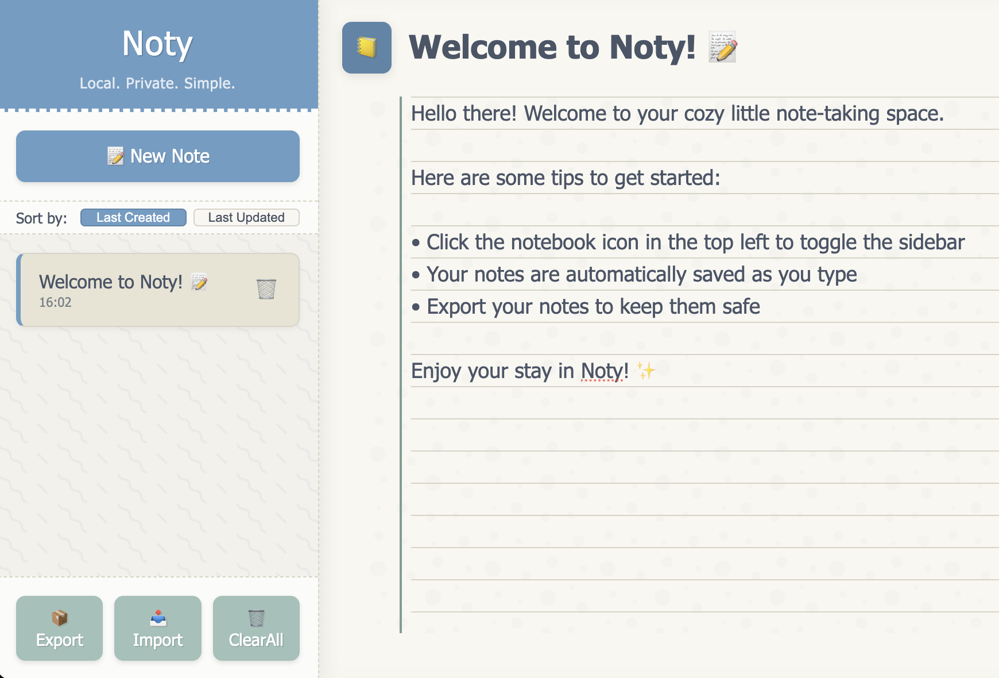

# Noty

A minimalist, local-first note-taking app that runs in your browser. No accounts, no cloud storage - just your notes stored privately in your browser.



## Features

- 📝 Create and edit notes with a clean, notebook-like interface
- 📱 Responsive design works on desktop and mobile
- 🔒 Privacy-focused: all data stays in your browser's local storage
- 📥 Export/import notes as JSON for backup and transfer
- 📎 No installation required, just open in any modern browser

## How to Use

1. Simply open `index.html` in any modern web browser
2. Create notes with the "New Note" button or Ctrl+N / Cmd+N
3. Your notes are automatically saved as you type
4. Toggle the sidebar with the notebook icon in the top left
5. Export your notes periodically as a backup

### Hosted Version

Noty is also available online at [usenoty.xyz](https://usenoty.xyz). The hosted version offers the same features with the convenience of accessing your notes from any device with a web browser.

## Development

Noty is built with vanilla JavaScript, HTML, and CSS. No build process required!

To contribute:
1. Fork the repository
2. Make your changes
3. Create a pull request

## License

Noty is released under the MIT License.

```
MIT License

Copyright (c) 2023

Permission is hereby granted, free of charge, to any person obtaining a copy
of this software and associated documentation files (the "Software"), to deal
in the Software without restriction, including without limitation the rights
to use, copy, modify, merge, publish, distribute, sublicense, and/or sell
copies of the Software, and to permit persons to whom the Software is
furnished to do so, subject to the following conditions:

The above copyright notice and this permission notice shall be included in all
copies or substantial portions of the Software.

THE SOFTWARE IS PROVIDED "AS IS", WITHOUT WARRANTY OF ANY KIND, EXPRESS OR
IMPLIED, INCLUDING BUT NOT LIMITED TO THE WARRANTIES OF MERCHANTABILITY,
FITNESS FOR A PARTICULAR PURPOSE AND NONINFRINGEMENT. IN NO EVENT SHALL THE
AUTHORS OR COPYRIGHT HOLDERS BE LIABLE FOR ANY CLAIM, DAMAGES OR OTHER
LIABILITY, WHETHER IN AN ACTION OF CONTRACT, TORT OR OTHERWISE, ARISING FROM,
OUT OF OR IN CONNECTION WITH THE SOFTWARE OR THE USE OR OTHER DEALINGS IN THE
SOFTWARE.
``` 
